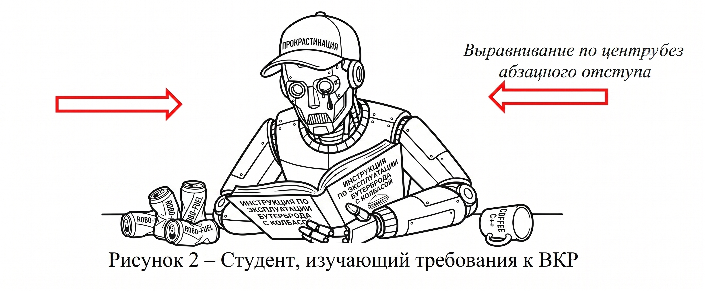

# Конвертер из .md в .docx и .pdf 

Можно конвертировать руками через convert.sh предварительно настроив окружение через setup.sh или закинуть skill в LLM.

После конвертации содержание будет пустым, нужно закинуть файл .docx в word или libreoffice чтобы его обновить. Чтобы этого не делать есть флаг --update-toc, но word делает содержание красивее.

Еще есть флаг --pdf-libre который добавит конвертацию в .pdf

**Для обоих флагов нужен установленный libreoffice.**

```
.
├── example.docx                # Конвертированный из markdown .docx
├── example.md                  # Пример markdown
├── example.pdf                 # Конвертированный из markdown .docx
├── hasbulla.jpg
├── itmo-vkr                    # Директория со скиллом для LLM. Помогает писать в формате предусмотренном ГОСТом, а также содержит скрипты и инструкции по конвертации
│   ├── assets
│   │   └── template.md         # Шаблон ВКР
│   ├── references
│   │   └── требования_вкр.pdf  # БАЗА
│   ├── scripts
│   │   ├── build_reference.py  # Скрипт для создания reference.docx
│   │   ├── convert.sh          # Скрипт для конвертации
│   │   ├── reference.docx
│   │   ├── setup.sh
│   │   └── update_toc.py
│   └── SKILL.md
└── README.md
```


